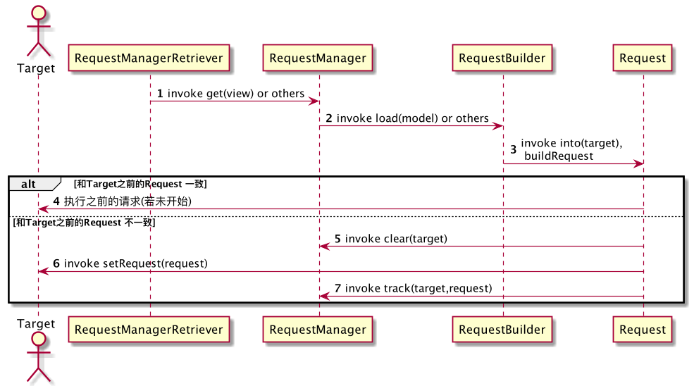
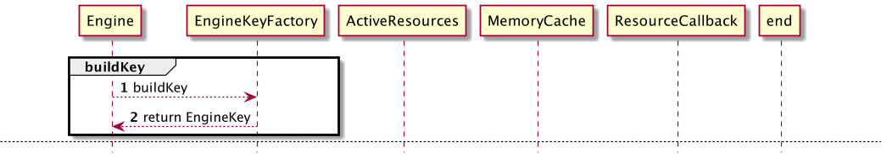

# 三思系列：Glide 4.X加载过程一文掌握 | Glide（二）

上一篇中，我们通过阅读Glide初始化的主要代码，对Glide中的模块进行了职责梳理。这一篇，我们在前文的基础上，对Glide的 `资源加载过程` 进行梳理。

当然，通过博文来看 `大篇幅` 的代码是相当 `枯燥乏味` 的，为了让阅读体验更佳，本文中会直接用 `UML图` 代替绝大多数的 `代码拷贝`。

*注：本文基于Glide 4.12.0。另：我的UML功底不太牢，文中涉及的UML图未必是最恰当的，如图类型或者标识错用，如果读者对此有所建树，我真诚的希望你可以在留言区留下宝贵的参考意见。*

再次介绍下三思系列：
> 三思系列是我最新的学习、总结形式，着重于:**问题分析**、**技术积累**、**视野拓展**，[了解更多](https://github.com/leobert-lan/Blog/blob/main/info/%E5%85%B3%E4%BA%8E%E4%B8%89%E6%80%9D%E7%B3%BB%E5%88%97.md)

---

## 攻坚突破口

在第一篇收尾时，我们总结了深度分析时的突破口，和加载过程强关联的内容摘录如下：

> 资源获取
>
> * RequestManagerRetriever
> * RequestManager
> * RequestBuilder
> * Request
> * DefaultConnectivityMonitorFactory
> 
> 核心流程
> 
> * Engine
>
> 资源Model加载器
> 
> * `ModelLoaderFactory`
> * `ModelLoader` 等

如果读者在阅读本文时，手边刚好有Glide的源码，可以配合阅读。

## Request的构建

不难理解，Glide在设计时，将 `资源加载` & `资源处理` & `资源使用` 等指令描述封装在了 `Request` 实现类中。

最简单的使用Sample代码：


```
// Samples/imgur
// com.bumptech.glide.samples.imgur.MainActivity

ImgurGlide.with(vh.imageView)
      .load(image.link)
      .into(vh.imageView);
```

调用 Glide.with 得到 `RequestManagerRetriever` 实例，并进一步调用 RequestManagerRetriever.get 得到 `RequestManager` 实例

而接下来的过程，则如下图所示，*相比于此图，以文字形式描述的过程略显啰嗦*




图中的 1、2、3 表示了Request的创建过程。

当创建完成后，需要执行 Request，但需要注意，Glide处理了一个 `很重要` 的问题：

> Target复用场景下，与Resource并非 `一一对应`

并且这个问题在 `网络环境变化`、 `生命周期协同` 等背景下被放大。

所以在开始执行请求前，还需要进行一层判断：

> 对于该Target，`本次` 请求的Request是否与 `前次` 请求的Request一致？

* 一致，执行前次请求
* 不一致，清空与target绑定的各种关系；设置本次请求；执行请求

```java
class RequestBuilder {
    private <Y extends Target<TranscodeType>> Y into(
            @NonNull Y target,
            @Nullable RequestListener<TranscodeType> targetListener,
            @NonNull RequestOptions options) {
        //...

        options = options.autoClone();
        Request request = buildRequest(target, targetListener, options);

        Request previous = target.getRequest();
        if (request.isEquivalentTo(previous)
                && !isSkipMemoryCacheWithCompletePreviousRequest(options, previous)) {
            request.recycle();
            if (!Preconditions.checkNotNull(previous).isRunning()) {
                previous.begin();
            }
            return target;
        }

        requestManager.clear(target);
        target.setRequest(request);
        requestManager.track(target, request);

        return target;
    }
}
```

*其他代码忽略*

## Request的触发

前文中，我们已经阅读到了 `新Request` 的触发环节，入口代码如下：
```java
class RequestManager {
    void track(@NonNull Target<?> target, @NonNull Request request) {
        targetTracker.track(target);
        requestTracker.runRequest(request);
    }
}
```

接下来挖掘下Request触发流程细节，依旧先看图：


`1、2` 两步对应了 `RequestManager#track(Target<?> target, Request request)`, 标签中备注了`1` 处为 `生命周期监测`

> 简要扩展：`TargetTracker` 是一个 `组合模式` 实现，实现了 Glide 中的 `LifecycleListener`，当关联的对象的生命周期产生变化时，这些变化会被感知，并且
`TargetTracker` 会被回调，实现请求的生命周期协同管理。

而 `2` 则开始处理请求：

* 如果当前 RequestTracker 是运行中的，则直接调用 `Request#begin()` 执行请求； `5`
* 否则加入等待队列，当 `resumeRequests` 或 `restartRequests` 被调用时，进入运行状态，调用 `Request#begin()` 执行请求； `3、4`


## Request执行细节

在开始阅读请求细节之前，不妨先了解下Request中的状态机制。

不难理解：Request的整个过程是 `复杂的`，设计中，将其设计成不同的 `切面过程` ，处于不同的状态时，处理对应的切面，这样可以降低外部调度时的复杂度。

### 状态概览

状态的枚举如下：

```java
private enum Status {
    /**
     * Created but not yet running.
     */
    PENDING,
    /**
     * In the process of fetching media.
     */
    RUNNING,
    /**
     * Waiting for a callback given to the Target to be called to 
     * determine target dimensions.
     */
    WAITING_FOR_SIZE,
    /**
     * Finished loading media successfully.
     */
    COMPLETE,
    /**
     * Failed to load media, may be restarted.
     */
    FAILED,
    /**
     * Cancelled by the user, may not be restarted.
     */
    CANCELLED,
    /**
     * Cleared by the user with a placeholder set, may not be restarted.
     */
    CLEARED,
    /**
     * Temporarily paused by the system, may be restarted.
     */
    PAUSED,
  }
```

阅读代码后，整理主要的状态变化图如下：*在阅读处理细节时，还会提到相应的内容*


### Request处理流程一

这一小节，我们将涉及这三个细节：

* 尺寸获取 
* 必要的PlaceHolder设置
* 向Engine 发起加载请求


如前文所提及:

* 当资源无法通过校验，将直接进入 FAILED
* 当一切都已准备就绪，即 COMPLETE，则进入资源处理流程 `onResourceReady`

否则进入 `WAITING_FOR_SIZE`，并处理尺寸处理

* 如果已经测量过的尺寸是合法的，进入 `onSizeReady`； `2、11`
* 否则获取尺寸，并挂Callback； `3、5、6、7、8、9、10、11`

*注意：当onSizeReady后，状态将变为 RUNNING，进入资源获取流程，即`11`，并且，如果有必要处理PlaceHolder且满足条件，则会在begin时处理PlaceHolder设置，即`4`*

不难理解：处理请求时，Target的尺寸未必处于可测量状态，Glide内利用了ViewTree的回调机制，以ViewTarget为例，当该Target进入 `PreDraw状态` 时，
开始测量尺寸，准确的讲是 `获取尺寸`。

至此，我们即将阅读到了 `资源加载` 过程。

### Request处理流程二 -- 资源加载

这一小节，我们专注于一个流程细节：`资源加载` 过程

简单想象一下，一个媒体资源，它的真身可能存在于："网络中的某台主机"，"本地的磁盘的用户文件目录下"，"当前应用的核心资源目录下" 等等。

使用这些资源时，`均从原始位置获取` 的方式是不可取的，除了 `最大的获取成本` 外，还额外付诸 `加载时间、解析算力成本`。

> 不难理解：在资源有效时限可被信任的前提下，有必要设计缓存机制，`牺牲空间换取时间和算力` 。
> 
> 下一篇中，我们将深入Glide的缓存机制，挖掘细节；在本篇中，读者仅需要先记住：
> * Glide 设计了缓存
> * 缓存包含 `内存缓存`，`磁盘缓存`；内存缓存中包含两个级别：`已加载激活的缓存`、`LRU缓存以及映射`； 磁盘缓存包含两个级别：`已解码数据`，`原始数据`
> * 不同的缓存使用策略，同时对应了缓存的`存储`、`获取`

整个加载流程可以分为3个环节：
* 生成key
* 从内存缓存中获取
* 使用EngineJob 从磁盘缓存中获取

同样先给出图：*为了方便阅读，将流程切分成了5张图*




---
接下来我们逐步分析


`1、2`是生成key过程，**注意：KEY的生成方式中，隐藏着危险**。

不难理解，对同一个媒体资源，采用不同的处理方式，得到的结果存在差别，缓存时，必须 `完整的` 考虑到这些处理差别，否则会出现 `资源错用`。*本文先不对此进行展开*

---


接下来执行 `loadFromActiveResources`,即从 `已加载激活的缓存` 中获取

如果不允许使用内存缓存，则直接返回null进入下一级缓存获取

如果得到了缓存资源，则直接运用；否则进入下一级缓存获取

---

此时，激活缓存未取到目标资源，将进入LRU内存缓存获取


同样的，如果不允许使用内存缓存，则直接返回null进入下一级缓存获取

如果得到了缓存资源，*将从LRU内存缓存中被remove，做LRU标记维护，并被加载到 `激活缓存` 中激活*，则直接运用；否则进入下一级缓存获取。

---

至此，内存缓存无法支持目标资源的获取，需要转向磁盘缓存

*不难理解：这里的内在细节会很复杂。将在缓存分析篇章中展开*

同样不难理解：当细节非常复杂时，有必要进行 `封装` ，`隐藏实现细节`，对调用者提供语义恰当的 `API` 即可。

Glide中，将这些细节封装为 EngineJob 和 DecodeJob；

不难理解：这种加载过程是 `相对耗时` 的，没有必要 `阻塞式` 等待结果以使用；因此，在加载的过程中，完全可能出现以下场景： `同一资源` 被 `多次要求` 加载。
于是，对Job可以进行 `复用` ，获取到还在加载中的Job时，增加回调即可，如下图所示：


如果没有可复用的Job，则创建相应的Job，维护Job资源池，设置回调，如下图所示：


### Request处理流程三 -- 资源使用

在前文的讲解中，我们阅读到当资源加载成功后，会执行到： `Request#onResourceReady(Resource<?>, DataSource)`，而其实现内容即为资源使用。
当然加载失败，或者资源校验失败会执行 `onLoadFailed(GlideException e)`。

```java
class SingleRequest {
    @Override
    public void onResourceReady(Resource<?> resource, DataSource dataSource) {
        stateVerifier.throwIfRecycled();
        loadStatus = null;
        if (resource == null) {
            GlideException exception = new GlideException("...");
            onLoadFailed(exception);
            return;
        }

        Object received = resource.get();
        if (received == null || !transcodeClass.isAssignableFrom(received.getClass())) {
            releaseResource(resource);
            GlideException exception = new GlideException("...");
            onLoadFailed(exception);
            return;
        }

        if (!canSetResource()) {
            releaseResource(resource);
            // We can't put the status to complete before asking canSetResource().
            status = Status.COMPLETE;
            return;
        }

        onResourceReady((Resource<R>) resource, (R) received, dataSource);
    }
    
    private void onResourceReady(Resource<R> resource, R result, DataSource dataSource) {
        // We must call isFirstReadyResource before setting status.
        boolean isFirstResource = isFirstReadyResource();
        status = Status.COMPLETE;
        this.resource = resource;

        //log

        isCallingCallbacks = true;
        try {
            if ((requestListener == null
                    || !requestListener.onResourceReady(result, model, target, dataSource, isFirstResource))
                    && (targetListener == null
                    || !targetListener.onResourceReady(result, model, target, dataSource, isFirstResource))) {
                Transition<? super R> animation =
                        animationFactory.build(dataSource, isFirstResource);
                target.onResourceReady(result, animation);
            }
        } finally {
            isCallingCallbacks = false;
        }

        notifyLoadSuccess();
    }
}

```

*注意:RequestListener 以及 TargetListener的处理，在使用监听器 `附加` 一些功能时，例如 `采集埋点`、 `依赖状态触发`，需要注意此处细节。*

而Target实现类的具体实现，本文略去，感兴趣的读者还请自行阅读源码。

## 内容总结

这是一张Glide 3.x时代的架构图，仅供参考
<div style="background-color: white">

</div>

*图片有区域透明，使用了html加了背景色，如果被转义了，[请看这里](http://sniffer-site.oss-cn-shenzhen.aliyuncs.com/GlideDiagram.png)*

图中，`蓝色` 和 `紫色` 区域对应了资源加载过程，`黄色` 区域对应了原始资源获取，`品红色` 区域对应了内部线程池。

*虽然这张图已经无法和 `Glide 4.x` 完全对应，但是处理问题的主要流程还是没有变化的。*

本文的内容，是在 `Glide 4.12.0版本基础上` 对 `蓝色区域` 的 `深度挖掘` 以及对 `紫色区域` 的 `简要梳理` *择去了缓存实现细节*。

## 思危、思退、思变

在加载过程分析中，我们已经罗列了部分可能出现错误使用的地方。这些点需要注意并在使用中避开。

本文中没有涉及到具体案例，所以没有 `更优做法` ， `更合适的做法` 。

但阅读优秀的源码，可以分析其设计思路，思考这样设计的优劣。

如：

* Request 根据内在状态枚举处理切面，在异步处理的过程中，隐藏了内在实现，仅提供最简单的控制API，如 `begin`，`pause`；又为什么不使用 `状态模式`？
* Engine 作为整个流程的控制核心，这是一种 `Facade模式` 实践，如果没有它的存在，则使用者需要清晰的了解：
    * 缓存的使用细节
    * EngineJob的调度等 <p>
      而增加了 Facade层后，对使用者而言，仅需要知道其功能和API语义即可。

当然，这些内容以及更细致的思考，需要建立在 `有目的` 地源码阅读上，而本文所起到的作用，类似于 `引子`，`参考`。

---

假期到了，也希望读者们去踏踏青，锻炼锻炼，拥有健康的身体状态！

最近会降低写原创的频次，*先前一周写两到三篇着实也有些累*。