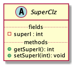

# 好玩系列：白嫖一个优雅的类图生成工具

## 前言

首先必须声明，**这不是一篇广告或者标题党**。 而是我开源了一个工具，可以优雅的为Java or Kotlin 项目生成 `Class Diagram`。

我推测列为读者会进来阅读，原因无非以下两点：

* 获得一个生成类图的工具，并通过文章快速了解是否 `方便` 且 `好用`
* 了解一下我是如何折腾的

仅关心如何使用的，可以移步 <a href="#demo">使用示例</a>

## 主要问题与方案

### 背景

> 背景：笔者今年换了份工作，所在的公司属于 `医疗器械` 下的细分领域，而相比于 `纯互联网行业` 领域，`医疗器械` 领域所属的配套软件，
> 都有明确的文档要求，不再是 `可有可无`。
>
> 设计类文档又占据了很大一部分，众所周知，设计类文档中备受关注的部分是：
> * 问题
> * 解决方案，*而且以UML图形式表现 `算法`、`时序`、`组件架构` 会更加形象*

毋庸置疑，对于一个产品，如果有 `准确的` 、`关键的` 算法流程图，时序图，组件图，状态图，类图等， 对于产品本身的维护及发展都有很大帮助，当然，对产品所对应的软件更是如此！

既然我们需要做文档工作，那更进一步， 把 "各类对研发有帮助的类图" 都维护好，是 `稳赚不亏` 的。

上文提到的各类UML图中，有一个是特殊的，即 `类图 Class-Diagram`, 它表述的是 `类之间的关系` ，**一般可以基于源码文件分析得出准确的结果**，相比之下，
流程图、时序图、状态图则需要理解源码才可以得出，组件图则更不适合从源码分析得出。

### 问题

在多年的工作中，笔者也遇到了一些问题：

* 业务迭代后或者代码改进后，文档（uml图）未及时更新
* 手动维护耗时耗力
* Intellij Idea 的插件虽然还挺好用，但需要支持正版Idea，当然，我支持在工作以及个人学习中都支持正版。 *此处省略好多字*
* 一直未找到比较好用的替代插件

综上所述：我们需要一款工具或者插件，可以直接基于源码生成类图 *（或者中间产物，例如：plant-uml文件）* ，能够配合其他工具链，直接进行归档。当然，最重要是免费， 这省去了说服公司进行购买的必要

### 解决方案

付费支持官方插件永远是一个省时省力的方案，这是个兜底方案。最终没辙时，我们再考虑它。

#### 编码时分析

仿照官方插件的思路，基于源码文档树进行分析，在Intellij的支持下，基于 PSI和uast 即可分析出类之间的关系。这需要一定的PSI、uast知识基础。

#### 编译时分析

在整个编译环节中，有一些切面应对特定问题，例如："注解处理" 、 "Gradle Transformer" ，在此切面处，我们可以基于编译中间产物，间接分析出类之间的关系。

最简单的是 **注解处理阶段** 介入，**这只需要对 Element 和 TypeMirror 有一定的知识基础即可**。

#### ~~运行时反射分析~~

显然这不是一个太好的切入点，直接pass。

---
> 考虑到PSI方面的知识体系掌握地不太完善，Intellij跨越大版本时，会有较大变更，
> 而注解处理方面的知识还过的了关，搞个类图生成问题不大。
>
> *PS: AndroidStudio 基于Intellij核心二次开发，PSI插件跟随Idea大版本进行适配*；
>
> **所以最终方案为：从注解处理阶段入手，分析编译中间产物，最终生成类图**

---

## 问题分治与解决

### 分治1 -- 简化输出产物

确定了大方向之后，我们需要再思考下整个问题的方方面面。生成类图有两大问题需要解决：

* 从~~源码~~、或者编译的中间产物中分析出类关系； *ps:我们已经确定了要从编译中间产物出发*
* 将类关系转变为图

显然，再开发一个 `图片引擎` 用来生成图，成本有点过大且没有必要。所幸的是，UML不是一个新生物，业内也有大名鼎鼎的PlantUml。

> [PlantUml](https://plantuml.com/zh/) 基于 [Graphviz](http://www.graphviz.org/) ， Graphviz 本身使用Dot语法描述元素与元素关系，
> 直接使用 Graphviz 比较朴素，PlantUml通过自定义语法，使得内容可阅读性提升，且无须关注转换图片时进行各类装饰问题

于是，我们可以将问题转化为：从编译的中间产物中分析出类关系，将关系按照PlantUml语法生成puml文件，它的内容是纯文本。

### 分治2 -- 确定分析的起始点

如果从最终结果看，我们得到的是一个 `有方向的图`，那么 **按照图本身的起始点出发** 比较符合习惯。

也就是说，我们将在起始点所对应的类上添加注解，作为注解处理的目标起始点

例如：


Cat 和 Dog 将作为起始点。

因为只需要标记类，我们约定注解：

```kotlin
@Target(AnnotationTarget.CLASS)
annotation class GenerateClassDiagram {}
```

在代码上，将表现为：

```kotlin
class Animal

@GenerateClassDiagram
class Dog : Animal()

@GenerateClassDiagram
class Cat : Animal()
```

在示例中，当我们处理 `GenerateClassDiagram` 时，可以扫描获得 `Cat` 以及 `Dog` 类对应的
`javax.lang.model.element.Element` 示例，下文简称 `Element`

> *几点可能存在的疑惑*:
> * 为何不 "双向" 分析：_继承和实现关系，双向分析会带来额外的复杂度，且在使用上规则不清晰，依赖关系难以双向分析_
> * 为何不标注在Animal上，进行反向分析： _如果高层级的类在库包中，则需要修改库包，这不利于日常管理与维护_
> * 如果只标注了Cat而没有标注Dog，Dog将不会体现在图中？：_是的_
> * 如果全部标注了，是否产生不良影响 ：_不会，但是没有必要_

### 分治3 -- 确定关系的分析方法

#### 继承&实现

因为注解的标记对象是类 *或者接口*，我们理应得到 `TypeElement`，基于 `Element` 的访问者模式实现，这一点并不难。

```java
public interface TypeElement extends Element, Parameterizable, QualifiedNameable {

    TypeMirror getSuperclass();

    List<? extends TypeMirror> getInterfaces();

    //其他无关代码略去
}
```

不言自明，我们可以通过 `TypeMirror getSuperclass();` 得到继承关系，通过 `List<? extends TypeMirror> getInterfaces();` 得到实现关系

> 注意，此处可以细分，接口和枚举仅需要分析实现关系即可，通过 `Element#getKind():ElementKind` 可以判断类型

#### 依赖&关联&聚合&组合

> 这四个关系非常的类似但又不同，**先降低复杂度**，均认为是依赖关系，*在后续迭代中，可以进一步增加功能，将关系细化*

进一步降低复杂度，我们仅从类的属性出发，分析依赖关系，忽略掉 **方法声明** *(可分析)*、**方法体** *(无法分析)* 、**静态块** *(无法分析)* 中 所包含的关系。

```java
public interface TypeElement extends Element, Parameterizable, QualifiedNameable {

    List<? extends Element> getEnclosedElements();
    //无关代码略去
}
```

不言自明，通过这一API，配合 `ElementFilter#fieldsIn(Iterable<? extends Element>):List<VariableElement>` 可以得到声明的 fields；

通过Element的API可以很轻易的得到 `命名` 以及 `修饰`；

通过 `Element#asType():TypeMirror` API 将其转换为TypeMirror后， 基于其Visitor模式设计可以得到field的类型 `DeclaredType` 并通过
`DeclaredType#asElement():Element` API重新得到Element

### 分治4 -- 确定分析的终点

在分治2中，我们已经确定了分析的起点 *(可能有多个)* ， 在分治3中，我们已经确定了关系的分析方式。为了方便表述，我们以：

```
Relation(From,End) 表述 从From 到 End 的关系
```

执行一轮 分治2&分治3，我们将得到一系列的 Relation(From,End)，此时我们将所有的 `End` 作为 `新的From`，不断迭代这一过程，即可完成图的遍历！

那么合适结束这一过程呢？

我们只需要维护一个集合 Sfrom，存储迭代过程中的 `From` ，每次得到的 `End` 只有满足 "不存在于Sfrom中" 这一条件时，才是 `新的From`，当无法获得
`新的From` 时，迭代结束

### 分治5 -- 分治3的补充，处理集合、数组、泛型

按照分治3中的约定，我们将集合、数组涉及的类型，以及泛型去泛化时的类型，都认为和当前类型是 `依赖关系`；*虽然这并不严谨*

得益于 `TypeMirror` 的 `Visitor模式` 实现，**我们很容易写出以下代码，获取我们关心的内容**！

```kotlin
private abstract class CastingTypeVisitor<T> constructor(private val label: String) :
    SimpleTypeVisitor6<T, Void?>() {
    override fun defaultAction(e: TypeMirror, v: Void?): T {
        throw IllegalArgumentException("$e does not represent a $label")
    }
}

private class FetchClassTypeVisitor : CastingTypeVisitor<List<DeclaredType>>(label = "") {
    override fun defaultAction(e: TypeMirror, v: Void?): List<DeclaredType> {
        //ignore it
        return emptyList()
    }

    override fun visitArray(t: ArrayType, p: Void?): List<DeclaredType> {
        return t.componentType.accept(this, p)
    }

    override fun visitWildcard(t: WildcardType, p: Void?): List<DeclaredType> {
        val ret = arrayListOf<DeclaredType>()

        t.superBound?.let {
            ret.addAll(it.accept(this, p))
        }
        t.extendsBound?.let {
            ret.addAll(it.accept(this, p))
        }
        return ret
    }

    override fun visitDeclared(t: DeclaredType, p: Void?): List<DeclaredType> {
        val ret = arrayListOf(t)
        t.typeArguments?.forEach {
            ret.addAll(it.accept(this, p))
        }
        return ret.toSet().toList()
    }

    override fun visitError(t: ErrorType, p: Void?): List<DeclaredType> {
        return visitDeclared(t, p)
    }

    override fun visitTypeVariable(t: TypeVariable, p: Void?): List<DeclaredType> {
        val ret = arrayListOf<DeclaredType>()

        t.lowerBound?.let {
            ret.addAll(it.accept(this, p))
        }
        t.upperBound?.let {
            ret.addAll(it.accept(this, p))
        }
        return ret
    }
}

fun TypeMirror.fetchDeclaredType(): List<DeclaredType> {
    return this.accept(FetchClassTypeVisitor(), null)
}
```

### 分治6 -- 关系的存储

显然，我们需要一个合适的数据结构用以存储图，得益于我去年在 [组件化：组件的按序初始化](https://juejin.cn/post/6884492604370026503/)
方面的一些探索，当时我开发了 [Maat](https://github.com/leobert-lan/Maat) 其中包含 **组件依赖关系的有向无环图分析**，其中包含DAG的实现。

很显然，我们将 "无环检测" 禁用，就可以直接将数据结构拿来使用了，不需要再制造轮子！

显而易见，Relation的各种情况可以和 `度` 建立映射关系，人为维护一个 `虚拟顶点` 作为遍历的起始点可以减少很多麻烦。

### 分治7 -- 类型的细节处理

在分治3中，我们已经已经对类型 *(enum、class、interface)* 进行了很充分的分析，但还遗漏了一些细节，例如方法、修饰符等；

在分治6中，我们确定了关系存储方案，我们还需要描述图的顶点。

我们定义 UmlElement类来进行描述

```kotlin
abstract class UmlElement(val diagram: ClassDiagram?, val element: Element?) {
    /**
     * return: plant-uml 中相应的文本
     * */
    abstract fun umlElement(context: MutableSet<UmlElement>): String
    
    abstract fun parseFieldAndMethod(diagram: ClassDiagram,
                                     graph: DAG<UmlElement>,
                                     cache: MutableSet<UmlElement>)
    
    abstract fun drawField(fieldDrawer: FieldDrawer, 
                           builder: StringBuilder,
                           context: MutableSet<UmlElement>)
    
    abstract fun drawMethod(methodDrawer: MethodDrawer,
                            builder: StringBuilder,
                            context: MutableSet<UmlElement>)
}
```
并实现：

* UmlInterface：接口
* UmlEnum： 枚举
* UmlClass： 类
* UmlStub：分治6中提到的虚拟顶点

定义：IElementDrawer 接口 与 IJavaxElementDrawer 接口

```kotlin
interface IElementDrawer {
    fun drawAspect(builder: StringBuilder, element: UmlElement, context: MutableSet<UmlElement>)
}

interface IJavaxElementDrawer {
    fun drawAspect(builder: StringBuilder, element: Element, context: MutableSet<UmlElement>)
}
```

并参考Plant-Uml的语法规则，**实现了一系列的切面处理**，例如：修饰符解析与输出，类型解析与输出，名称解析与输出，方法解析与输出 **等**

*此处使用了责任链，将Element转化plantUml语法进行了链式切分，并定义了一系列的切面处理。**限于篇幅不做展开，有兴趣的读者可以在文末获取源码了解更多***

例如：

```kotlin
abstract class SuperClz : SealedI {
    var superI: Int = 0
}
```
其Element被处理后，将转变为如下的文本内容：

```puml
abstract class "SuperClz"{
  .. fields ..
  {field}-superI : int
  .. methods ..
  {method}+ getSuperI(): int
  {method}+ setSuperI(int): void
}
```

由PlantUml处理后形如：



### 分治8 -- 输出为PlantUml文件

得益于我先前的一些探索，我曾开发过一款注解处理器，用于生成文档，[简单了解](https://blog.csdn.net/a774057695/article/details/106603455) ，
基于SPI机制，我们可以很轻松的实现一个扩展，实现上面提到的所有内容，并且轻松的输出文本文档。

*虽然在APT中输出一些文本文档是一件很简单的事情，但我决定使用以前造的轮子，毕竟它本身就是为了生成文档而开发的*

---

至此，我们已经对整个问题的主要流程进行了推演，可以得出结论：这件事情可以成！

**感谢我老婆早早就买到了中秋节回家的高铁票**，我坐在舒适的座位上，在 **回家的途中** 便完成了上述内容的推演，并进行了框架编写与冒烟。

现在将其整理成稿花费的时间居然更多，看起来情绪能够很大程度影响生产力和创造力！

---

## 保持优雅

显而易见，上述的内容仅止于 "解决问题" ， 还不能 "出色的解决问题"。

例如：

* 绘制多张ClassDiagram
* 增加配置，屏蔽一些输出，例如：不想看见 `private` 修饰的fields
* 包名是在是太长了，产生干扰

等等。

那继续雕琢即可！

### 维持简单
在继续雕琢功能的同时，我们必须兼顾 `简单性` ，这一点非常重要！

一方面，我们不要过早的考虑用不着的功能，维持功能体系的简单。另一方面，功能使用要简单，方法或规则要明确。

例如在实现 "绘制多张ClassDiagram" 功能时：

* 我最先想到的是在 `GenerateClassDiagram` 中添加`qualifier:List<String>`, 可以将被标识的类分配到不同的组别。但是它看起来并不太友好
* 于是我产生了：将配置与标识分离的想法。定义一个注解，可以进行配置，它仅可被标识于注解。

```kotlin
@Target(AnnotationTarget.ANNOTATION_CLASS)
annotation class ClassDiagram(
    val qualifier: String = "",
    val fieldVisible: Array<Visible> = [Visible.Private, Visible.Protected, Visible.Package, Visible.Public],
    val methodVisible: Array<Visible> = [Visible.Private, Visible.Protected, Visible.Package, Visible.Public],
)
```

这样使用者可以自由的定义注解，例如：

```kotlin
@ClassDiagram("Demo")
annotation class DemoDiagram
```

这样，注解处理器需要关心的注解将变为两个：

* ClassDiagram : 标识注解表达分组，并且包含配置
* GenerateClassDiagram ：标识类图中的分析起始点

如此，我们使用时的规则更加清晰！注意，被GenerateClassDiagram 注解的类，必须添加分组注解，即 `被DemoDiagram注解的注解` 否则将被忽略

例如：

```kotlin
@GenerateClassDiagram
@DemoDiagram
class Clz : SuperClz(), SealedI {
    val int: Int? = null
}
```

*目前增加的功能，仅仅是在前文大流程上的细节优化，实现不再展开*

### 减少侵入

从上文我们可以获知，为了使用这一插件，我们需要在代码中进行侵入修改，那么理应将侵入保持到最小！这也是 `将配置与标识分离` 的重要原因。

在后续功能迭代设计中，同样需要考虑这一点，这也是分治3中，将组合、聚合等关系先表示为依赖的一个客观原因, *原先我的设计中，将由使用者注解标识其关系，但侵入性大大提升*。

能够以归因推断的方式得出的结论，就不要以注解去标识，过多的注解会影响源码可读性且增大侵入！

### 扩展能力

在设计时，还有一些功能尚未有优雅的解决方案，在前文也有所提及。

在编码设计时，我预留了足够的扩展性用于装饰Plant-Uml语法文档，如果读者有处理方案，可以直接扩展后提PR。

*因本文并非为介绍编程技巧，此处不再展开*

[项目地址](https://github.com/leobert-lan/ReportPrinter/)

## <a id="demo">使用示例</a>

### 添加依赖

```
implementation "io.github.leobert-lan:class-diagram-reporter:1.0.0"
annotationProcessor "io.github.leobert-lan:report-anno-compiler:1.1.4"
annotationProcessor "io.github.leobert-lan:class-diagram-reporter:1.0.0"
```

均已发布到MavenCentral，最新版本号可参考以下：

*
*[](https://search.maven.org/search?q=g:io.github.leobert-lan%20And%20a:report-anno-compiler)

*
*[](https://search.maven.org/search?q=g:io.github.leobert-lan%20And%20a:class-diagram-reporter)

配置信息：

```groovy
kapt {
    arguments {
        arg("module", "ktsample") //模块名称
        arg("mode", "mode_file") 
        arg("active_reporter", "on")
    }
}
```

### 自行定义注解

该注解需被 `ClassDiagram` 注解，其他自行配置

例如：

```kotlin
@ClassDiagram(qualifier = "BridgePattern")
annotation class BridgePatternDiagram

//or

@ClassDiagram(
    qualifier = "AAAB",
    fieldVisible = {Visible.Package, Visible.Public}
)
public @interface AAAB {
}
```

配合 `GenerateClassDiagram` 注解使用

此处以桥接模式示例，一个满足桥接模式的代码实现如下：

```kotlin
class BridgePattern {

    @ClassDiagram(qualifier = "BridgePattern")
    annotation class BridgePatternDiagram

    interface MessageImplementor {
        fun send(message: String, toUser: String)
    }

    abstract class AbstractMessage(private val impl: MessageImplementor) {
        open fun sendMessage(message: String, toUser: String) {
            impl.send(message, toUser)
        }
    }

    @BridgePatternDiagram
    @GenerateClassDiagram
    class CommonMessage(impl: MessageImplementor) : AbstractMessage(impl)

    @BridgePatternDiagram
    @GenerateClassDiagram
    class UrgencyMessage(impl: MessageImplementor) : AbstractMessage(impl) {
        override fun sendMessage(message: String, toUser: String) {
            super.sendMessage("加急：$message", toUser)
        }
    }

    @BridgePatternDiagram
    @GenerateClassDiagram
    class MessageSMS : MessageImplementor {
        override fun send(message: String, toUser: String) {
            println("使用系统内短消息的方法，发送消息'$message'给$toUser")
        }
    }

    @BridgePatternDiagram
    @GenerateClassDiagram
    class MessageEmail : MessageImplementor {
        override fun send(message: String, toUser: String) {
            println("使用邮件短消息的方法，发送消息'$message'给$toUser")
        }
    }
}
```

编译后，我们得到的puml文件，渲染后得到：


*恰好满足了plant-uml package定义的语法，否则不会有package*

我们可以注意到，关系上没有太大问题，AbstractMessage 与 MessageImplementor 之间表现为关联更加恰当。

除此之外，从阅读习惯上而言，图中的一些位置关系，还需要再调整，我们可以在后续的版本加，添加相应的配置方式。


## 絮叨

从中秋节开始设计，零零碎碎完成开发，再到国庆准备写博客，又陆续做了几次修改。期间，家中也出了意外，在此也诚挚的希望各位读者注意身体，多花些时间在家人身上。代码是写不完的，知识是学不完的，但健康和生命都是有尽头的。

[了解好玩系列](https://leobert-lan.github.io/Info/about_haowan_series.html)